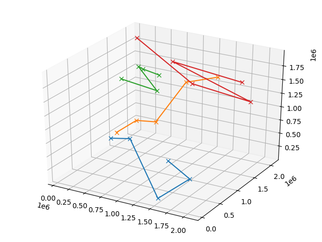

# hashedOctree



This repository holds a simple C++ snipped which creates a N-particle uniform-distribution in 3D-space and orders the 
particles by means of an hashed Octree as described in 
[PEPC: Pretty Efficient Parallel Coulomb-solver](https://www.fz-juelich.de/ias/jsc/EN/AboutUs/Organisation/ComputationalScience/Simlabs/slpp/Software/SoftwarePEPC/FZJ-ZAM-IB-2003-05.pdf?__blob=publicationFile).
The results can be plotted or the hash table of the particle distribution can be saved to a csv-file.

## Build
To build the project run `make`.

> Bug: `make` throws an error when the directory `resources` doesn't exist so just create it with `mkdir resources`.

*Note:* This project is not intended to run on Windows.

## Usage
```
A demonstrator for hashing an octree by z-ordering
Usage:
  hashedOctree [OPTION...]

  -o, --output-csv       Write results to a csv-file
  -p, --plot             Plot the results and show
  -s, --save-plot        Plot the result and save
  -K, --K-domains arg    Number of domains (default: 4)
  -N, --N-particles arg  Number of particles (default: 20)
  -f, --file-prefix arg  Filename w/o extension (default: hot_result)
  -h, --help             Show this help
```

### 3D-plotting into an interactive window
Use the command `bin/hashedOctree -p` and a window will pop up, which shows the space filling curve splitted into 
domains identified by different colors. 

Modify the number of particles N and of domains K with `bin/hashedOctree -p -N 15 -K 3` for N=15 and K=3.

### Saving the plot as image
Use `bin/hashedOctree -s` to save the plot to `hot_result.png` or 
`bin/hashedOctree -s -N 12 --file-prefix hot_N12` to save to `hot_N12.png`. 

### Store the results in a csv-file
Use `bin/hashedOctree -o --file-prefix hot_N20` to save the hash table to as csv-file where a row consists of 
`key, i_x, i_y, i_z`. 

The Python script `utils/readCsv.py` serves as a template for reading in the generated csv results and processing the 
data afterwards in Python.

## Used Libraries
* **matplotlib-cpp:** For plotting [matplotlib-cpp](https://github.com/lava/matplotlib-cpp) has been slightly modified 
  to enable multiple line objects in 3D plot and the used header file is `include/matplotlibcpp.h`.
* **cxxopts:** For parsing command line options in GNU style [cxxopts](https://github.com/jarro2783/cxxopts) 
  is utilized.
  


